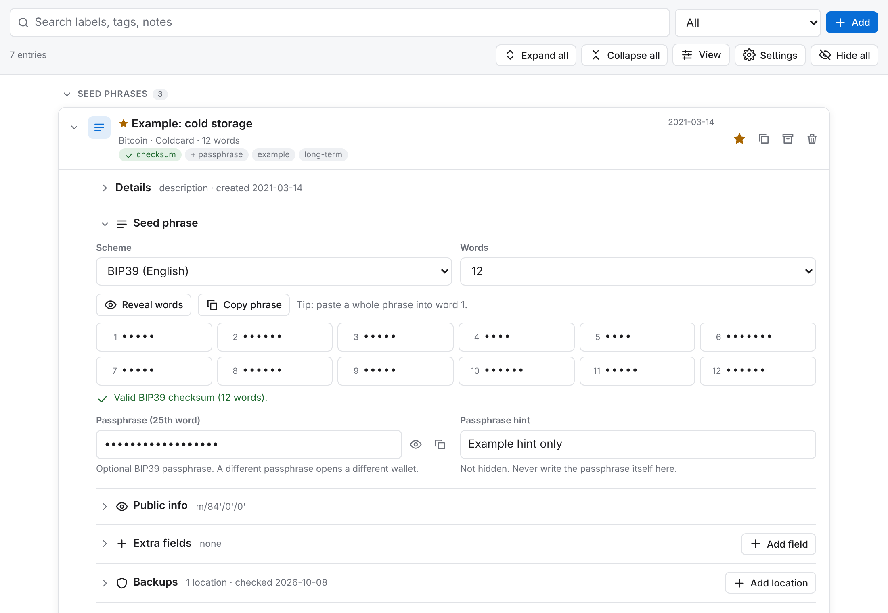
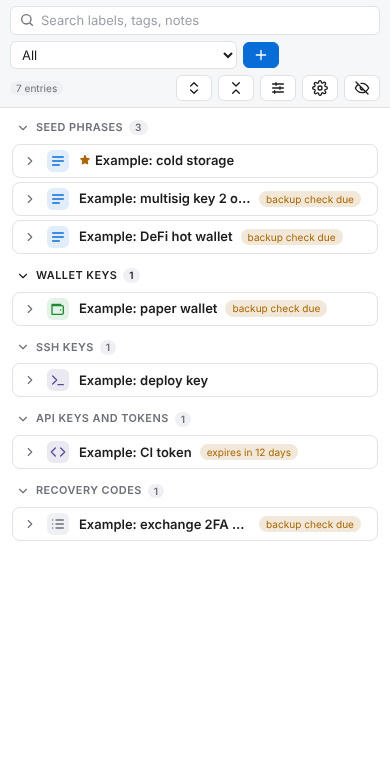

# Keyfold

**Your keys and recovery phrases, folded into one encrypted Standard Notes note.**

Keyfold is a [Standard Notes](https://standardnotes.com) plugin for crypto seed phrases and wallet keys, plus the other cryptographic keys in your life: SSH and PGP keys, API tokens and recovery codes. Each one folds into a one-line card. Secrets stay hidden until you reveal them, every format Keyfold knows is checked for typos, and an optional second password can encrypt the whole note again.





## Crypto first

**Seed phrases of any length**
- 12, 15, 18, 21 and 24-word BIP39 phrases, 20/33-word SLIP-39 shares, 25-word Monero seeds, or any custom count up to 48 words.
- Each word sits in its own numbered, masked field. Paste a whole phrase into word 1 and it fills the grid. Numbered phrases copied from a backup sheet with several columns are put back in order.
- BIP39 checks: every word is checked against the official wordlist, the checksum is verified, typos get "did you mean" suggestions, and English 4-letter abbreviations can be expanded with one click. Words are never changed without you asking: for BIP39 phrases in other languages or old Electrum seeds, choose **Other**.
- Electrum 2.0+ seeds are validated and their type shown (standard, segwit, 2FA); an Electrum seed entered as BIP39 is pointed out.
- Monero 25- and 13-word seeds have their checksum word verified.
- Aezeed (LND) 24-word seeds have their checksum verified, without needing the seed's password; an aezeed seed entered as BIP39, or the reverse, is pointed out.
- A hidden field for the BIP39 passphrase ("25th word"), plus a visible hint for it.

**Wallet keys**
- Recognizes and checks hex (raw 32-byte / EVM), WIF (Bitcoin, Litecoin, Dogecoin, Dash, testnet) with its Base58Check checksum, BIP32 and SLIP-132 extended keys (xprv, yprv, zprv, Yprv, Zprv, tprv, Litecoin and Dogecoin versions...), Nostr `nsec`, Cardano and other Bech32 secret keys in either case, Solana base58 and byte-array keypairs, and encrypted keystores (V3 and EIP-2335, with a field for the password).
- Warns you if you paste public data instead (an address, xpub or npub), a key with a broken checksum or a missing character, or a private key into a field that is not hidden.

**Wallet details**
- Chain or coin, wallet or device, derivation path, master fingerprint, addresses or xpub.
- Backup locations, each with a "last checked" date. Seed phrases, wallet keys, PGP keys and recovery codes whose backups were not checked recently are flagged.

## Every other key

| Type | What Keyfold recognizes |
|---|---|
| **SSH keys** | OpenSSH private keys (Ed25519, RSA, ECDSA, security keys), including whether they are passphrase-protected or were copied incompletely; PuTTY keys (checked for missing lines); PEM keys. Public key and fingerprint fields. |
| **PGP keys** | Armored private key blocks, with the armor checksum verified. Public key and fingerprint fields. |
| **API keys and tokens** | GitHub, GitLab, npm, Stripe, Slack, Google, AWS, SendGrid, DigitalOcean, `sk-` style keys and JSON Web Tokens. |
| **Other keys** | age (also whole age-keygen files), WireGuard and other 32-byte base64 keys, PEM (PKCS#1, PKCS#8, SEC1; checked for a missing line, and certificate + key bundles), JSON Web Keys and key sets, Google Cloud service account files, AWS credentials files. |
| **Recovery codes** | One code per line, hidden, with a count. |
| **Other secrets** | Any mix of named fields, each shown or hidden as you choose. |

SSH, PGP, API and other keys have an **expiry date**: Keyfold flags them 30 days before they expire, and a filter lists everything expiring or expired. Keyfold also warns when you paste a public key, certificate or PGP message where a private key belongs.

## Many keys in one note, without the clutter

- Each entry is a card that folds into one line (label, type, chain or service, word count, checksum, expiry and backup status) and opens when you click it. Expand all, collapse all, or have opening one card close the others.
- Inside a card, every section collapses to a one-line summary. The secret opens by default and the rest stays folded.
- Entries are grouped by type, with seed phrases and wallet keys first. You can also group by chain or service, wallet or account, or first tag, and sort by last update, label or creation date.
- Compact density turns every entry into a single row. A list-beside-editor layout is available under **View**.
- Search covers labels, descriptions, tags, notes, public details, visible custom fields and backup locations, never secret values. Labels sort numerically ("Wallet 2" before "Wallet 10").
- Favorites, archive, duplicate, delete with undo, custom fields and free-form notes on every entry.

## Privacy and security

- Secrets are masked until revealed and hide themselves again after 30 seconds (configurable), or when the editor loses focus. With a keyboard, a seed word shows only while you type it, never just because it has focus.
- Hidden secrets are real password fields: phone keyboards do not learn them, screen readers do not read them aloud, and they cannot be copied with Ctrl+C. Multi-line keys are not on the page at all until revealed.
- Copying a secret (with the Copy button, Ctrl+C or a long press) clears the clipboard after 30 seconds. Inside Standard Notes the browser only allows this during a click or tap, so it happens on your next click or tap in Keyfold, or with **Clear now**; locking the vault clears it right away. It stays copied if you leave the note first.
- Warnings when a visible field gives a secret away: a passphrase hint containing the passphrase, notes repeating the key or several seed words, a private key pasted into public info.
- Spellcheck, autocorrect, autofill and password-manager capture are off on secret fields, so nothing is sent to cloud spellcheckers.
- An optional **vault password** adds a second layer on top of Standard Notes' end-to-end encryption: AES-256-GCM with a key derived by PBKDF2-SHA256 (600,000 iterations). The vault auto-locks after inactivity. Weak passwords need an explicit confirmation, and restoring an unprotected version from note history is called out.
- **Nothing leaves the editor.** The Content Security Policy blocks every outgoing connection, and scripts, images and fonts from other sites. The only outside files it loads are your Standard Notes theme's stylesheets. The only runtime dependency is Preact, and Keyfold talks to Standard Notes with its own small implementation of the plugin message protocol.
- **Encrypted backup files** for a flash drive or anywhere outside Standard Notes, with a password of their own. The single-file offline viewer opens them in any browser, without Standard Notes or an internet connection (see [Recovering your data](#recovering-your-data-without-keyfold)). Settings shows when you last made one and how many entries changed since.
- An optional privacy screen blurs the vault whenever the editor is not focused.
- Follows Standard Notes' "Prevent editing" lock and its themes (built-in and installed, on desktop, web and phones), and never overwrites a note that already had other content. A vault saved by a newer Keyfold opens read-only rather than being rewritten.
- Keyboard and screen-reader friendly, with Windows High Contrast support.

## Install

1. In Standard Notes, open **Preferences → Plugins**.
2. Under **Install Custom Plugin**, paste this URL and install:
   ```
   https://nickstruglia.github.io/standard-notes-keyfold/ext.json
   ```
3. Create a new note, open the editor menu, and choose **Keyfold**.

Open the URL above without `ext.json` to try a demo in your browser (sample data only, nothing is saved).

**Moving to a new address or your own fork.** Standard Notes keeps using the first copy of Keyfold you installed, even if you install another, so:

1. In **Preferences → Plugins**, uninstall the old Keyfold.
2. Right away, before opening any Keyfold note, install the new `ext.json` URL. On desktop, restart the app afterwards.
3. Your notes open in the new copy: they are linked to the plugin's identifier, which never changes.

If a Keyfold note opens in another editor in between (for example an empty Authenticator list), do not add anything there: reinstall Keyfold, and use **Note history** to restore the note if something was saved. Notes created before October 2026 may still open in Authenticator when Keyfold is missing, because Standard Notes stored that note type with each note.

## Mobile

The Standard Notes iOS and Android apps run plugins in the same sandboxed frame as the web app, loaded from the plugin's URL, so Keyfold needs an internet connection on a phone. The desktop app keeps an offline copy and updates it whenever a newer version is published (each deploy has its own version number). The layout, touch targets and keyboard handling are built for phones, and every browser test runs at Android, iPhone and 320 px phone sizes with touch enabled. On touch screens, seed words stay masked while you type them unless you tap **Reveal words**. Phrases in other scripts (Japanese, Chinese...) can be pasted but not typed on phones, because phone keyboards only offer Latin letters in hidden fields.

The phone apps send Standard Notes' built-in themes to plugins as embedded stylesheets (`data:` URLs), which Keyfold accepts. Until those are ready they send a link to the app's local theme file, which a plugin loaded from the web cannot open, so Keyfold loads the same theme from Standard Notes' web app (`app.standardnotes.com`) instead.

Tested in the Standard Notes Android app. Not yet verified on an iPhone (Safari's engine, WebKit). Try it with a dummy phrase first.

## Security notes

Read these before storing keys that protect real funds or systems:

- **Who you trust.** Standard Notes loads Keyfold from the URL in `ext.json` (web and phones load it every time; desktop downloads each new version), so whoever controls that site controls the code that sees your secrets. If you are not the maintainer, fork this repository and install from your own GitHub Pages URL (see below). Settings → About shows which site your copy comes from.
- **Exports and backups.** Standard Notes' exports, decrypted backups and the desktop app's optional plaintext backups contain your vault as plain JSON unless you set a vault password. Keyfold's own backup files are always encrypted, with the password you choose when making them; anyone who gets the file can try guessing it offline, so make it a strong one.
- **Your device.** A compromised computer, malicious browser extension or keylogger can read anything you type or reveal. For large amounts, keep keys on a hardware wallet and treat Keyfold as an encrypted record, not your only backup.
- **Note history.** Standard Notes keeps earlier versions of a note. If you add a vault password after entering secrets, older revisions still hold the data without that extra layer (Standard Notes' own encryption still protects them). Set the password on a new vault before adding secrets, or delete the old revisions.
- **Clipboard.** Clipboard clearing is best effort. Clipboard history tools (Windows Win+V, clipboard managers, universal clipboard) and phone keyboards (Gboard, Samsung Keyboard) keep their own copies, which no web page can delete. On a phone, delete the entry from the keyboard's clipboard panel, or turn its clipboard history off.
- **Forgotten vault password.** It cannot be recovered by anyone.

See [SECURITY.md](SECURITY.md) for the threat model and how to report a vulnerability.

## How data is stored

The note text is JSON. Without a vault password:

```json
{ "app": "keyfold", "version": 1, "readme": "...", "vault": { "entries": [...], "settings": {...} } }
```

With a vault password, `vault` is replaced by an encrypted blob:

```json
{ "app": "keyfold", "version": 1, "readme": "...",
  "encryption": { "kdf": "PBKDF2-SHA256", "iterations": 600000, "salt": "...", "cipher": "AES-256-GCM", "iv": "...", "ciphertext": "..." } }
```

A backup file has the same shape as an encrypted note, plus the time it was made (`"exportedAt"`), so anything that opens a note opens a backup.

The preview in Standard Notes' note list contains only counts (for example "Keyfold: 2 seed phrases, 1 SSH key"), never labels or secrets.

## Recovering your data without Keyfold

**Backup files.** In Keyfold's **Settings → Backup file**, choose **Make a backup file**, pick a password for it and save the file (`keyfold-backup-<date>.json`) somewhere other than Standard Notes: a flash drive, an external disk, another cloud. Keep the [offline viewer](https://nickstruglia.github.io/standard-notes-keyfold/keyfold-viewer.html) next to it: its **Save this viewer** link downloads it as one file, `keyfold-viewer.html`, which is also in [`keyfold.zip`](https://nickstruglia.github.io/standard-notes-keyfold/keyfold.zip). Make a new backup after adding or changing keys.

- **To read a backup**, open `keyfold-viewer.html` in any browser, choose the backup file (or drop it on the page) and enter its password. It works offline, is read-only and saves nothing.
- **To restore a backup** into Standard Notes, paste the file's whole text into a new note, change the note type to Keyfold and unlock it with the backup password. Keyfold then saves it as an ordinary vault with that password.
- **On a phone**, the Standard Notes app may not save files from plugins: use **Copy as text** and paste it into a file or another app, or make the backup on a computer.

**Recovery viewer.** The same viewer opens a note's text: open `keyfold-viewer.html`, [the site with `#open`](https://nickstruglia.github.io/standard-notes-keyfold/#open) or `index.html#open` from the unzipped `keyfold.zip`, choose **Paste a note's text instead**, paste it and enter the vault password if it has one.

To get the note's text, or if Keyfold does not open at all (offline phone, plugin removed, site down), open the note menu and change the note type to **Plain text** to read the JSON. Do not edit it there, and never convert it to **Super**: Super's import collapses spaces and drops text after a `<`. If you did, restore the note from **Note history**.

A plain vault is readable as is: each entry has its `label`, `kind`, `words` (in order) or `secret`, and `\n` in a value is a line break.

An encrypted vault or backup file can be decrypted with any WebCrypto implementation. This script runs in Node.js 20+ or in the console of any https page (not `about:blank`):

```js
const noteText = `...paste the whole note or backup file text here...`
const password = '...your vault or backup password...'

const { encryption: e } = JSON.parse(noteText)
const bytes = (b64) => Uint8Array.from(atob(b64), (c) => c.charCodeAt(0))
const enc = new TextEncoder()
const material = await crypto.subtle.importKey('raw', enc.encode(password.normalize('NFC')), 'PBKDF2', false, ['deriveKey'])
const key = await crypto.subtle.deriveKey(
  { name: 'PBKDF2', hash: 'SHA-256', salt: bytes(e.salt), iterations: e.iterations },
  material, { name: 'AES-GCM', length: 256 }, false, ['decrypt'])
const plain = await crypto.subtle.decrypt(
  { name: 'AES-GCM', iv: bytes(e.iv), additionalData: enc.encode(`keyfold|1|PBKDF2-SHA256|${e.iterations}|AES-256-GCM`) },
  key, bytes(e.ciphertext))
console.log(JSON.parse(new TextDecoder().decode(plain)))
```

The format: PBKDF2-SHA256 over the NFC-normalized password with the stored salt and iteration count gives an AES-256-GCM key; the 12-byte IV is stored, the ciphertext ends with the 16-byte tag, the associated data is `keyfold|1|PBKDF2-SHA256|<iterations>|AES-256-GCM`, and the plaintext is the vault as JSON.

## Development

Requires Node.js 22.12 or later. Dependencies never run install scripts (`.npmrc`).

```bash
npm ci
npm run dev        # then open http://localhost:5173/dev/host.html?sandbox=0
npm run typecheck
npm test           # unit tests (validators checked against @scure reference libraries and published test vectors)
npm run build
npm run test:e2e   # Playwright tests against the production build: desktop, Android, iPhone and 320 px phone sizes
```

`dev/host.html` is a mock of the Standard Notes side of the plugin protocol (`dev/null-origin.html` wraps it so the app's origin is "null", as in the mobile apps). It frames the editor with the same sandbox Standard Notes uses (add `?sandbox=0` for the Vite dev server, whose ES modules need same-origin access). It shows the saved note text live, and it can toggle "Prevent editing", switch to a dark theme, and simulate an edit from another device. Add `?mobile=1` to register the way the phone apps do, with themes as `data:` URLs (`?mobile=file` for their `file://` fallback).

## Deploy your own copy

1. Fork this repository.
2. In the fork, go to **Settings → Pages** and set **Source** to **GitHub Actions**.
3. Run the **Deploy to GitHub Pages** workflow (Actions tab), or push to the default branch.
4. Uninstall any other Keyfold first (see "Moving to a new address" above), then install `https://<your-username>.github.io/standard-notes-keyfold/ext.json` in Standard Notes.

The workflow runs the tests, writes your Pages URL into `ext.json` and the Content Security Policy, names the plugin "Keyfold (<your-username>)" so it is easy to tell apart, and publishes `keyfold.zip` for the desktop app's offline mode. Building elsewhere? Set `SITE_URL` to the address you will serve it from, or the policy will not let the script load.

## License

[MIT](LICENSE) © 2026 Nicholas Truglia
